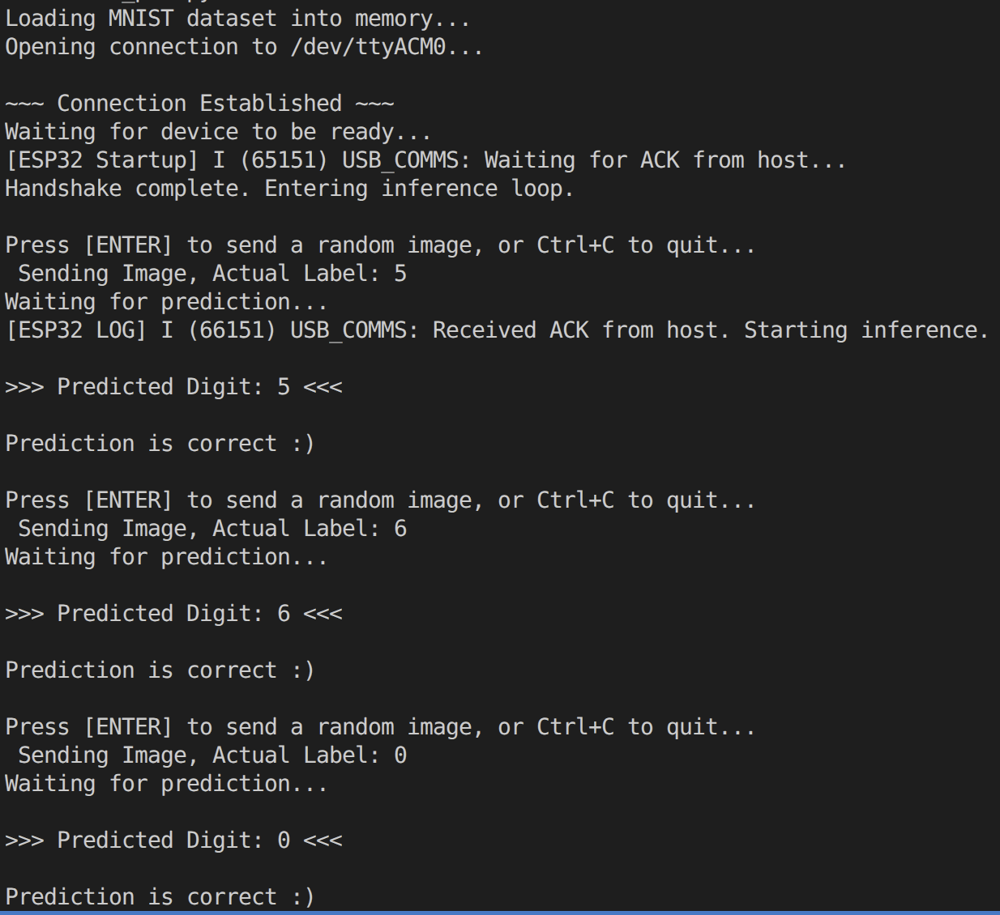

# ESP32-S3 Edge AI: MNIST Digit Recognizer

**Note:** *This README file is AI generated. Although it has been reviewed and edited for accuracy, please verify the instructions and code snippets before executing them in your environment. There are no dangerous commands in this README, but always exercise caution when running scripts or flashing firmware to your hardware. Any suggestions are welcome!*

**Code away 😉!**

This repository demonstrates how to train a lightweight neural network to recognize MNIST digits, quantize the weights to INT8, and deploy the model onto an ESP32-S3 microcontroller using ESP-IDF. A Python host script is used to send raw image data to the ESP32-S3 over a high-speed USB Serial/JTAG connection and receive the predictions in real-time.

> **Note on Operating Systems:** This project and its accompanying scripts are designed primarily for **Linux** (specifically targeting ports like `/dev/ttyACM0`). If you are running **Windows**, you will need to modify the serial port variables in the Python script (e.g., to `COM3`) and ensure you have the appropriate USB-Serial drivers installed.

---

## Phase 1: Generating the Model

Before flashing the ESP32, you need to train the neural network and export its weights into a C-compatible header file.

**1. Install Python Dependencies**
Ensure you have the required machine learning and data processing libraries installed:
`pip install torch torchvision numpy pandas matplotlib scipy kagglehub`

**2. Run the Jupyter Notebook**
Open `mnist-edge_modelgen.ipynb` in Kaggle. 
This notebook performs the following:
* Downloads the MNIST dataset.
* Trains a 3-layer Multilayer Perceptron (MLP) (784 -> 100 -> 40 -> 10) using PyTorch.
* Symmetrically quantizes the FP32 weights and biases into INT8 format to save memory and optimize inference on the ESP32.
* Generates a `model_weights.h` file containing the C-arrays and scale factors.

**3. Move the Header File**
Once the notebook finishes executing, locate the newly generated `model_weights.h` file and place it in the `components` directory of the ESP32 project. Remember to update the include paths in `CMakeLists.txt` if necessary.

---

## Phase 2: Flashing the ESP32-S3

The firmware is written in C++ using the ESP-IDF framework. It utilizes the `usb_serial_jtag` driver to create a fast communication bridge between your PC and the microcontroller.

**1. Setup ESP-IDF**
Open the project in VS Code with the official **Espressif ESP-IDF extension** installed and configured for your specific ESP32-S3 board.

**2. Build and Flash**
* Set the target to `esp32s3`.
* Build the project.
* Flash the firmware to your board.
* Once flashed, the ESP32-S3 will boot and begin continuously broadcasting `READY` over the USB-Serial connection, waiting for the host script to acknowledge.

Note: Make sure to include the `model_weights.h` path in the `CMakeLists.txt` file so that the compiler can locate it during the build process. This is already handled in the provided project file, but if you move files around or rename files, you may need to adjust the include paths accordingly.

---

## Phase 3: Running Host Inference

The host script (`send_pic.py`) handles downloading the test images, handshaking with the ESP32, formatting the data packets (with Magic Bytes and CRC32 for integrity), and displaying the results.

**1. Install Serial Dependencies**
You will need the `pyserial` library to interface with the ESP32:
`pip install pyserial torchvision numpy`

**2. Configure the Port (Important for Windows Users)**
Open `send_pic.py` and check the configuration section:

```python
# Configuration 
SERIAL_PORT = '/dev/ttyACM0'  # Linux default
BAUD_RATE = 115200
```

